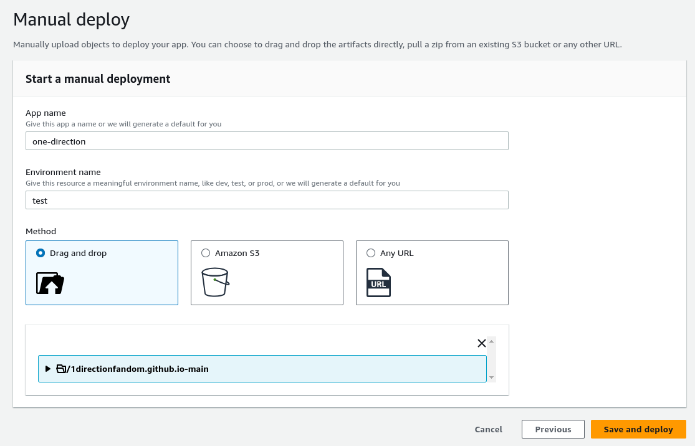

Name -  Priyanshu Lapkale  
Class - TY B  
Roll No - 322067  
PRN - 22220008  

------
## Hosting Static Website using AWS Amplify ##
* AWS Amplify Hosting is Fastest, easiest way to develop mobile and web apps that scale.
* AWS Amplify is a set of products and tools that enable mobile and front-end web developers to build and deploy secure, scalable full-stack applications, powered by AWS.
 
 
To Get started go to services in AWS Console and search for AWS Amplify. Our purpost is to host a static site, so scroll down at the bottom of the page and select *Host your web app* and *Get started* 

 

* Then select from where you want to upload your code. They support variety of options but will just be using drag and drop so we'll select *Deploy without Git Provider*

    

 

* Give a suitable name for your app
* Give a meaningful env name e.g. prod, test, dev
* Select upload method and upload the code (I just drag and dropped the entire directory of the static site)
* Now click *Save and Deploy*
 

 
Uploading of code and Deployment will take some time so just sit back and relax. Once it's successfully deployed copy the domain and paste it in another tab.

 
 
Your site is live now - 

 
 
If you want a fully functional site you can also set up your backend environment. AWS Amplify support wide variety of frameworks and tools.

 
 
Here we can conclude that we've successfully hosted a static site using AWS Amplify.

