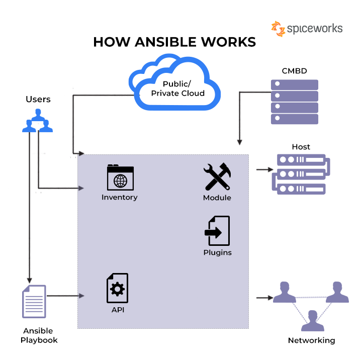

Name -  Priyanshu Lapkale <br />
Class - TY B <br />
Roll No - 322067 <br />
PRN - 22220008 <br />

------
# Assignment 6 #
## Write an ansible-playbook to install nginx on target servers. ##

### What is YAML? ###
YAML is a human-readable data serialization language that is often used for writing configuration files. Depending on whom you ask, YAML stands for yet another markup language or YAML ain’t markup language (a recursive acronym), which emphasizes that YAML is for data, not documents. 

YAML is a popular programming language because it is designed to be easy to read and understand. It can also be used in conjunction with other programming languages. Because of its flexibility, and accessibility, YAML is used by Ansible® to create automation processes, in the form of Ansible Playbooks.

### YAML Syntax - ###
YAML files use a .yml or .yaml extension, and follow specific syntax rules. 

YAML has features that come from Perl, C, XML, HTML, and other programming languages. YAML is also a superset of JSON, so JSON files are valid in YAML.

There are no usual format symbols, such as braces, square brackets, closing tags, or quotation marks. And YAML files are simpler to read as they use Python-style indentation to determine the structure and indicate nesting. Tab characters are not allowed by design, to maintain portability across systems, so whitespaces—literal space characters—are used instead. 

Comments can be identified with a pound or hash symbol (#). It’s always a best practice to use comments, as they describe the intention of the code. YAML does not support multi-line comment, each line needs to be suffixed with the pound character.

A common question for YAML beginners is “What do the 3 dashes mean?” 3 dashes (---) are used to signal the start of a document, while each document ends with three dots (...).  

This is a very basic example of a YAML file:
```yaml
#Comment: This is a supermarket list using YAML
#Note that - character represents the list
---
food: 
  - vegetables: tomatoes #first list item
  - fruits: #second list item
      citrics: oranges 
      tropical: bananas
      nuts: peanuts
      sweets: raisins
```

### What is Ansible? ###
No matter your role, or your automation goals, Ansible can help you connect teams and deliver efficiencies.

Ansible is an open source IT automation engine that automates provisioning, configuration management, application deployment, orchestration, and many other IT processes. It is free to use, and the project benefits from the experience and intelligence of its thousands of contributors.

Red Hat® Ansible Automation Platform combines more than a dozen upstream projects into a unified, security-hardened enterprise platform for mission-critical automation. It builds on the foundation of the open source project to create an end-to-end automation experience for cross-functional teams.



