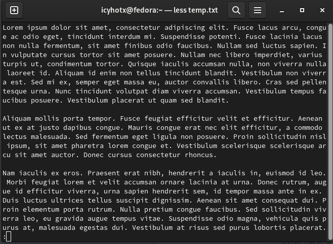

Name -  Priyanshu Lapkale <br />
Class - TY B <br />
Roll No - 322067 <br />
PRN - 22220008 <br />

------
# Assignment 1 #
## 50 essential linux commands for Cloud Computing##


1. ls - List directories
```shell
$ ls
 config         Documents           Music              st          wallpapers
course         Downloads           Pictures           temp
'Course Work'   GitHub              Public             Templates
 Desktop        latency.conf.save   pulse.properties   Videos
```

2. pwd - Print working directory
```shell
$ pwd
/home/icyhotx
```

3. cd - Navigate through directories
```shell
$ cd Downloads
/Downloads$ 
```

4.mkdir [folder_name]- Command used to create directories
```shell
$ mkdir Temp
$ cd Temp
/Temp$
```

5. mv - Move or Rename files
```shell
$ mv Temp Cache
$ cd Cache
/Cache$
```

6. cp - For copying files in linux
```shell
$ mv Temp Cache
$ cd Cache
/Cache$
```

7. rm - delete files and directories (use -r to delete a directory)
```shell
$ rm -r Cache
```

8. touch - create a blank or empty file
```shell
$ touch temp.txt 
```

9. cat - display content of the file
```shell
$ cat temp.txt
Hey there i'm a text file 
```

10. clear - clear the terminal display
```shell
$  clear
```

11. echo - prints any text that follows the command
```shell
$  echo 'Hey there'
Hey there
```

12. less - used to show paged output
```shell
$  less temp.txt
```


13. man - access manual page for any command
```shell
$  man echo
```
```
ECHO(1)                          User Commands                         ECHO(1)

NAME
       echo - display a line of text

SYNOPSIS
       echo [SHORT-OPTION]... [STRING]...
       echo LONG-OPTION

DESCRIPTION
       Echo the STRING(s) to standard output.

       -n     do not output the trailing newline

       -e     enable interpretation of backslash escapes

       -E     disable interpretation of backslash escapes (default)

       --help display this help and exit

       --version
              output version information and exit

 Manual page echo(1) line 1 (press h for help or q to quit)
```

14. uname - get basic information about the OS
```shell
$ uname
Linux
```

15. tar - Command to extract and compress files in linux
```shell
$ ls
temp.txt temp1.txt
$ tar -cvzf temp.tar.gz temp.txt temp1.txt
temp.txt
temp1.txt
$ ls 
temp.tar.gz temp.txt temp1.txt
```

16. whoami -  get active username
```shell
$ whoami
icyhotx
```

17. head - prints first few lines from a file (default = 10)
```shell
$ head temp.txt --lines=2
Lorem ipsum dolor sit amet, consectetur adipiscing elit.
Ut nec quam id mauris tincidunt porta.
```

18. tail - prints last few lines from a file (default = 10)
```shell
$ tail temp.txt -- lines=2
Mauris eleifend mi sit amet dui consectetur tristique.
Sed aliquam lectus vel leo volutpat, eget efficitur neque finibus.
```

19. grep — Search for a string within an output
```shell
$ cat temp.txt | grep Lorem
Lorem ipsum dolor sit amet, consectetur adipiscing elit.
```

20. diff - find the difference between two files
```shell
$ diff temp.txt temp1.txt
176,177d175
< Mauris eleifend mi sit amet dui consectetur tristique.
< Sed aliquam lectus vel leo volutpat, eget efficitur neque finibus.
```

21. cmp — Allows you to check if two files are identical
```shell 
$ cmp temp.txt temp1.txt
cmp: EOF on temp1.txt after byte 9758, line 175
```
 
22. comm — Combines the functionality of diff and cmp
```shell 
$ comm temp.txt temp1.txt
```

23. sort — Linux command to sort the content of a file while outputting
```shell
$ sort temp.txt
```
```
Aenean cursus nibh in arcu varius, et commodo ligula venenatis.
Aenean et justo non nisl varius ullamcorper sit amet in metus.
Aenean pellentesque est eget urna aliquam, non suscipit mauris convallis.
Aenean semper dolor at urna auctor, at imperdiet augue varius.
Aliquam eget ligula facilisis, tristique lectus at, iaculis orci.
Aliquam elementum augue eget arcu iaculis bibendum.
Aliquam et libero feugiat, ultrices risus in, euismod felis.
Aliquam quis enim ullamcorper, eleifend nisi a, egestas libero.
Aliquam ut lectus ut leo congue lacinia eu eget ipsum.
Aliquam ut turpis nec lorem suscipit condimentum.
Aliquam vel erat volutpat, auctor est at, mollis sapien.
Aliquam venenatis libero interdum nulla maximus, sed pharetra ante maximus.
Cras ac elit faucibus, ultricies lacus eget, fermentum nisi.
Cras aliquet nulla sit amet facilisis maximus.
Cras congue mi et elit condimentum dapibus.
Cras mattis augue eu ex elementum, vel vehicula libero malesuada.
Cras non ex ornare, commodo sapien tristique, lacinia elit.
Cras non risus non lorem feugiat ornare.
Cras sit amet tellus ultrices, vehicula augue ac, dapibus est.
Cras vel purus sagittis, auctor elit sit amet, facilisis metus.
Curabitur id mauris sit amet enim tempor tempus.
Curabitur nec augue aliquet, venenatis purus ultrices, feugiat massa.
```

24. export - export environment variables
```shell
$ export
```
```
declare -x COLORTERM="truecolor"
declare -x DBUS_SESSION_BUS_ADDRESS="unix:path=/run/user/1000/bus"
declare -x DEBUGINFOD_URLS="https://debuginfod.fedoraproject.org/ "
declare -x DESKTOP_SESSION="gnome"
declare -x DISPLAY=":0"
declare -x EDITOR="/usr/bin/nano"
declare -x GDMSESSION="gnome"
declare -x GDM_LANG="en_US.UTF-8"
declare -x GNOME_SETUP_DISPLAY=":1"
declare -x GNOME_TERMINAL_SCREEN="/org/gnome/Terminal/screen/299b74ae_1fed_4707_8099_065be21b1482"
declare -x GNOME_TERMINAL_SERVICE=":1.225"
```

25. zip - used to zip files
```shell
$ zip temp.zip temp.txt temp1.txt
    adding: temp.txt (deflated 68%)
    adding: temp1.txt (deflated 68%)
```

26. unzip - used to unzip files
```shell
$ unzip temp.zip
Archive:  temp.zip
replace temp.txt? [y]es, [n]o, [A]ll, [N]one, [r]ename: y
  inflating: temp.txt                
replace temp1.txt? [y]es, [n]o, [A]ll, [N]one, [r]ename: y
  inflating: temp1.txt  
```

27. ssh - secure shell command
```shell
$ ssh
usage: ssh [-46AaCfGgKkMNnqsTtVvXxYy] [-B bind_interface]
           [-b bind_address] [-c cipher_spec] [-D [bind_address:]port]
           [-E log_file] [-e escape_char] [-F configfile] [-I pkcs11]
           [-i identity_file] [-J [user@]host[:port]] [-L address]
           [-l login_name] [-m mac_spec] [-O ctl_cmd] [-o option] [-p port]
           [-Q query_option] [-R address] [-S ctl_path] [-W host:port]
           [-w local_tun[:remote_tun]] destination [command [argument ...]]
```

28. service - to start and stop service
```shell
$ service sshd stop
Redirecting to /bin/systemctl stop sshd.service
$ service sshd start
Redirecting to /bin/systemctl start sshd.service
```

29. ps - display active process
```shell
$ ps
    PID TTY          TIME CMD
   7080 pts/0    00:00:00 bash
  12093 pts/0    00:00:00 ps
```

30. ds - Display diskfile system information
```shell
$ ps
```
Filesystem     1K-blocks     Used Available Use% Mounted on
/dev/nvme0n1p9 133170176 14346568 117771816  11% /
devtmpfs            4096        0      4096   0% /dev
tmpfs            8076376     7024   8069352   1% /dev/shm
efivarfs             128       62        62  50% /sys/firmware/efi/efivars
tmpfs            3230552     2188   3228364   1% /run
/dev/nvme0n1p9 133170176 14346568 117771816  11% /home
/dev/nvme0n1p8    996780   318532    609436  35% /boot
/dev/nvme0n1p1    262144    67316    194828  26% /boot/efi
tmpfs            8076376     2984   8073392   1% /tmp
tmpfs            1615272    20912   1594360   2% /run/user/1000
```

31. chmod - to change permissions
    * r - read
    * w - write
    * x - execute

    * u - owner
    * g - group
    * o - others
```shell
$ chmod u-wrx text.txt
```


32. chown — Command for granting ownership of files or folders
```shell
$ chown -c icyhotx temp.txt
```

33. ifconfig — Display network interfaces and IP addresses
```shell
$ ifconfig
```
```
eno2: flags=4099<UP,BROADCAST,MULTICAST>  mtu 1500
        ether 24:4b:fe:6e:a7:17  txqueuelen 1000  (Ethernet)
        RX packets 0  bytes 0 (0.0 B)
        RX errors 0  dropped 0  overruns 0  frame 0
        TX packets 0  bytes 0 (0.0 B)
        TX errors 0  dropped 0 overruns 0  carrier 0  collisions 0

lo: flags=73<UP,LOOPBACK,RUNNING>  mtu 65536
        inet 127.0.0.1  netmask 255.0.0.0
        inet6 ::1  prefixlen 128  scopeid 0x10<host>
        loop  txqueuelen 1000  (Local Loopback)
        RX packets 117  bytes 9170 (8.9 KiB)
        RX errors 0  dropped 0  overruns 0  frame 0
        TX packets 117  bytes 9170 (8.9 KiB)
        TX errors 0  dropped 0 overruns 0  carrier 0  collisions 0

wlo1: flags=4163<UP,BROADCAST,RUNNING,MULTICAST>  mtu 1500
        inet 172.20.10.3  netmask 255.255.255.240  broadcast 172.20.10.15
        inet6 fe80::5015:a93a:343d:e0c0  prefixlen 64  scopeid 0x20<link>
        inet6 2401:4900:57a5:aa84:510d:7d95:a9a4:7686  prefixlen 64  scopeid 0x0<global>
        ether 40:ec:99:f4:cd:7e  txqueuelen 1000  (Ethernet)
        RX packets 290583  bytes 380219283 (362.6 MiB)
        RX errors 0  dropped 0  overruns 0  frame 0
        TX packets 79096  bytes 17442705 (16.6 MiB)
        TX errors 0  dropped 0 overruns 0  carrier 0  collisions 0
```

34. wget - to download files directly from the internet
```shell
$ wget https://pbs.twimg.com/media/FX7XLgJXkAImUa6?format=jpg&name=large
[1] 13261
```

35. whereis — Locate the binary, source, and manual pages for a command
```shell
$ whereis kill
kill: /usr/bin/kill /usr/share/man/man1/kill.1.gz /usr/share/man/man2/kill.2.gz
```

36. w - to check how many users logged into the linux
```shell
$ w
 16:25:54 up  1:56,  2 users,  load average: 0.91, 0.74, 0.63
USER     TTY        LOGIN@   IDLE   JCPU   PCPU WHAT
icyhotx  seat0     14:30    0.00s  0.00s   ?    /usr/libexec/gdm-wayland-sessio
icyhotx  tty2      14:30    1:56m  0.01s  0.01s /usr/libexec/gnome-session-bina
```

37. date -- used to check the current date, time in linux
```shell
$ date
Wed Feb  7 04:26:43 PM IST 2024
```

38. sudo — Command to escalate privileges in Linux
```shell
$ sudo su
[sudo] password for icyhotx: 
/home/icyhotx#
```

39. cal - view in-line calendar
```shell
$ cal
    February 2024   
Su Mo Tu We Th Fr Sa
             1  2  3
 4  5  6  7  8  9 10
11 12 13 14 15 16 17
18 19 20 21 22 23 24
25 26 27 28 29        
```

40. whatis - Find what a command is used for
```shell
$ whatis kill
kill (1)             - terminate a process
kill (2)             - send signal to a process
```

41. apt, yum, dnf, rpm - Package manage depending on distros
```shell
$ sudo dnf install spotify
```

42. top - View active processes live with their system usage
```shell
$ top
```
```
op - 16:35:40 up  2:06,  2 users,  load average: 0.88, 0.88, 0.73
Tasks: 396 total,   1 running, 394 sleeping,   0 stopped,   1 zombie
%Cpu(s):  2.3 us,  0.9 sy,  0.0 ni, 96.3 id,  0.1 wa,  0.3 hi,  0.1 si,  0.0 st 
MiB Mem :  15774.2 total,   5331.4 free,   4408.9 used,   7054.6 buff/cache     
MiB Swap:   8192.0 total,   8192.0 free,      0.0 used.  11365.2 avail Mem 

    PID USER      PR  NI    VIRT    RES    SHR S  %CPU  %MEM     TIME+ COMMAND  
   6930 icyhotx   20   0 1131.6g 194144 127004 S  22.2   1.2  11:42.46 brave    
   3499 icyhotx   20   0   33.0g 206276 117756 S   7.9   1.3   7:16.22 brave    
   2234 icyhotx   20   0 5376308 244140 117676 S   5.0   1.5   5:48.69 gnome-s+ 
   7061 icyhotx   20   0  849020  63888  40592 S   1.7   0.4   0:49.87 gnome-t+ 
   3345 icyhotx   20   0   32.7g 403292 199876 S   1.0   2.5   8:53.23 brave    
   4910 icyhotx   20   0 1135.1g 286232  98344 S   1.0   1.8   7:21.66 code     
  13749 icyhotx   20   0  226572   5248   3200 R   0.7   0.0   0:00.25 top      
```

43. kill --Command to kill the process (PID)
```shell
$ kill
```

44. useradd - to add a user
```shell
$ sudo useradd priyanshu
```

45. su - to switch user

```shell
$ sudo su
Password:
root@fedora:/home/icyhotx# su priyanshu
priyanshu@fedora:/home/icyhotx# 
```

46. userdel - used to delete a user
```shell
$ sudo su
Password:
root@fedora:/home/icyhotx# userdel priyanshu
root@fedora:/home/icyhotx#
```

47. chmod - powerful to manage users
```shell
root@fedora:/home/icyhotx# sudo usermod -e 2024-02-08 priyanshu
root@fedora:/home/icyhotx# sudo chage -l priyanshu
Last password change					: Feb 07, 2024
Password expires					: never
Password inactive					: never
Account expires						: Feb 08, 2024
Minimum number of days between password change		: 0
Maximum number of days between password change		: 99999
Number of days of warning before password expires	: 7
```

48. find - used to find files in a directory
```shell
$ find -name temp.txt
./temp.txt
```

49. curl - It is a command-line tool to transfer data to or from a server
```shell
$ curl https://www.google.com
```

50. uniq - remove duplicate lines from the file
```shell
$ uniq temp.txt
```