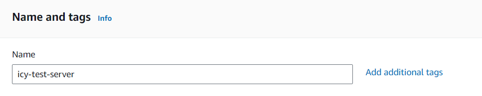
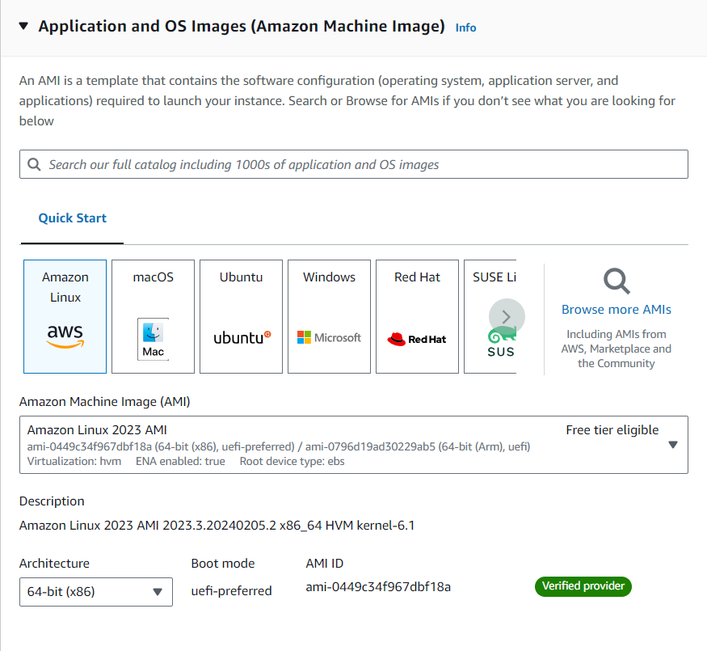
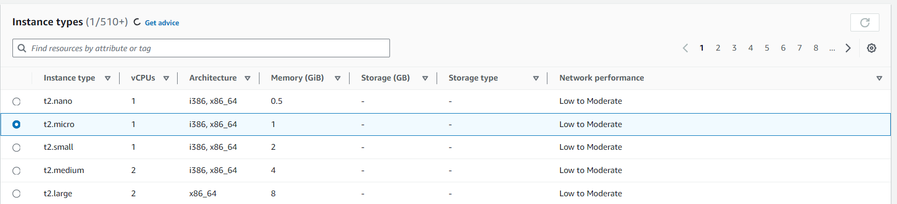
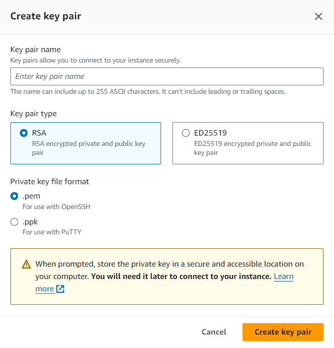
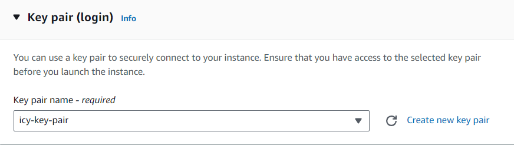
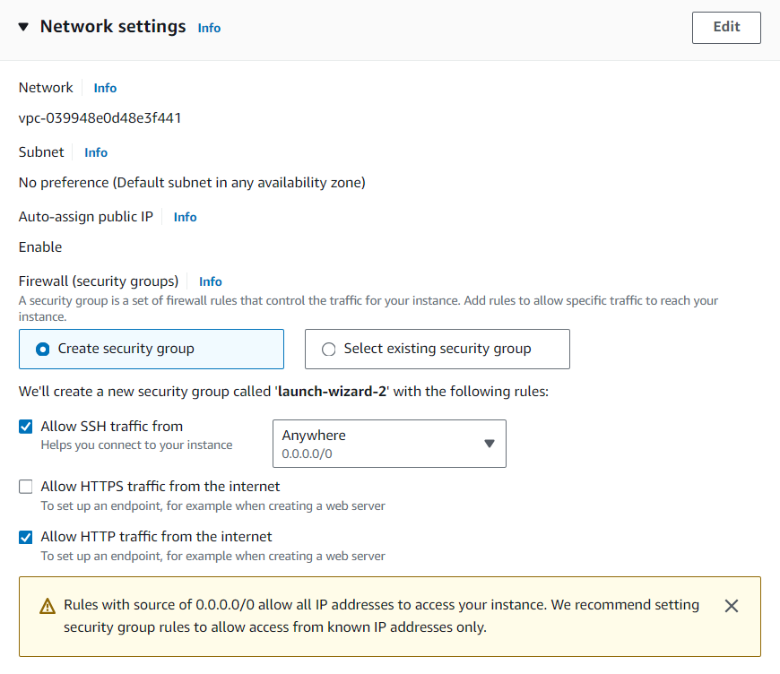
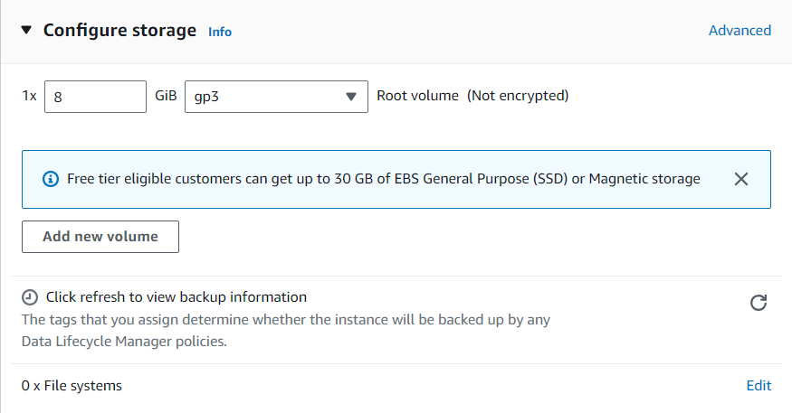

# Assignment 2 #
### Host a static Website on AWS EC2 Instance ###

First you have to create a free account on AWS to get started. For this it's mandatory to enter details of a Debit/Credit card.

* Now go to services and search for EC2 and click on it 
* Then click on Launch intance

Follow these steps - 

1. Set a name for your EC2 instance  
    This name should be unique and should be understandable for what purpose we made this instance.

2. Choose AMI(Amazon Machine Type)  
    Technically we are using amazon's hardware so we have to define which operating system we want on our virtual computer. There are multiple options available but we'll be going with AMAZON Linux 2 AMI.

    We'll use t2.micro because we only want to host a single static page.(Moreover because it's free XD)

3. Select the instance type
    Amazon provide a wide variety of instance based on our use case. They differ based on CPUs, Memory, Storage, etc.

4. Set Key Pair(login)  
    * Click on create new key pair and set a unique key name e.g. icy-key-pair
    * Select Key pair type (which security you want) e.g. RSA
    * Select Private key file format (We'll need these key file later) e.g. .pem
    

    Select your new key - 
    

5. Set Network Setting  
In network setting we have to define rules and boundaries, like how your instance will react to the outer world or let's say internet. 
We'll allow SSH traffic so that we can connect with our instance. HTTP traffic also because we are hosting a website and we want to access it via our browser.

6. Configure storage  
We can add more volume to our instance. But it'll depend on scale of our project and it'll also require money. We'll go with default i.e. 8 which is free tier.

Now Once Again Review the details and click on Launch Instance button.

