Name -  Priyanshu Lapkale <br />
Class - TY B <br />
Roll No - 322067 <br />
PRN - 22220008 <br />

------
# Assignment 2 #
## Host a static Website on AWS EC2 Instance ##

First you have to create a free account on AWS to get started. For this it's mandatory to enter details of a Debit/Credit card.

### Create an EC2 instance ###

* Go to services and search for EC2 and click on it 
* Then click on Launch intance

1. Set a name for your EC2 instance <br />
    This name should be unique and should be understandable for what purpose we made this instance.
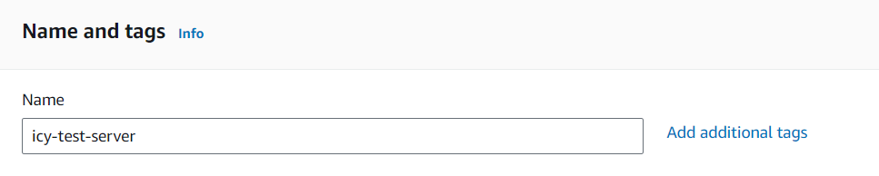

2. Choose AMI(Amazon Machine Type) <br />
    Technically we are using amazon's hardware so we have to define which operating system we want on our virtual computer. There are multiple options available but we'll be going with AMAZON Linux 2 AMI.

    We'll use t2.micro because we only want to host a single static page.(Moreover because it's free XD)
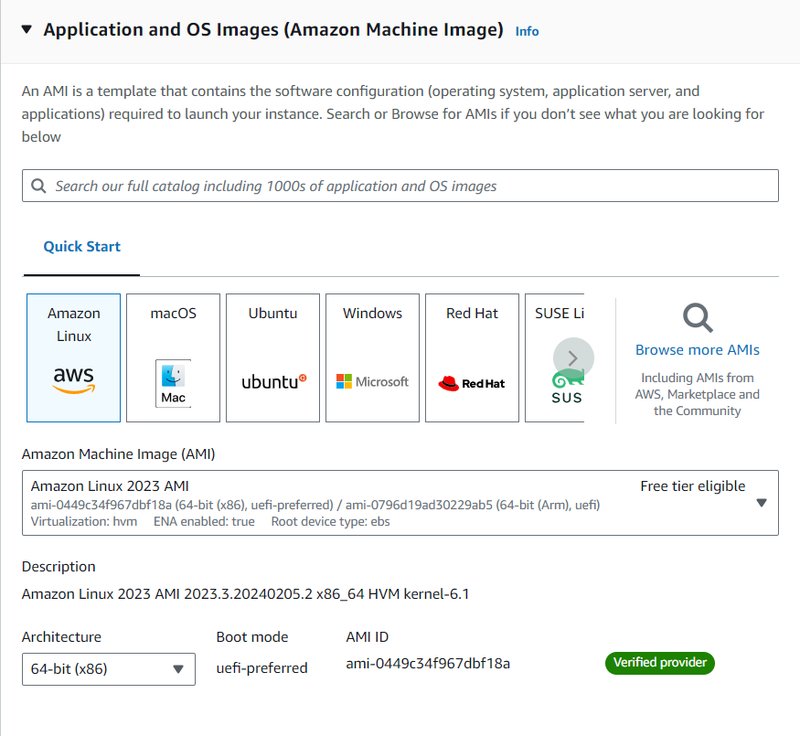

3. Select the instance type
    Amazon provide a wide variety of instance based on our use case. They differ based on CPUs, Memory, Storage, etc.
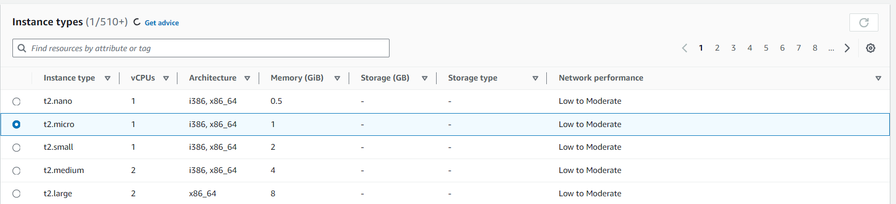

4. Set Key Pair(login) <br />
    * Click on create new key pair and set a unique key name e.g. icy-key-pair
    * Select Key pair type (which security you want) e.g. RSA
    * Select Private key file format (We'll need these key file later) e.g. .pem
    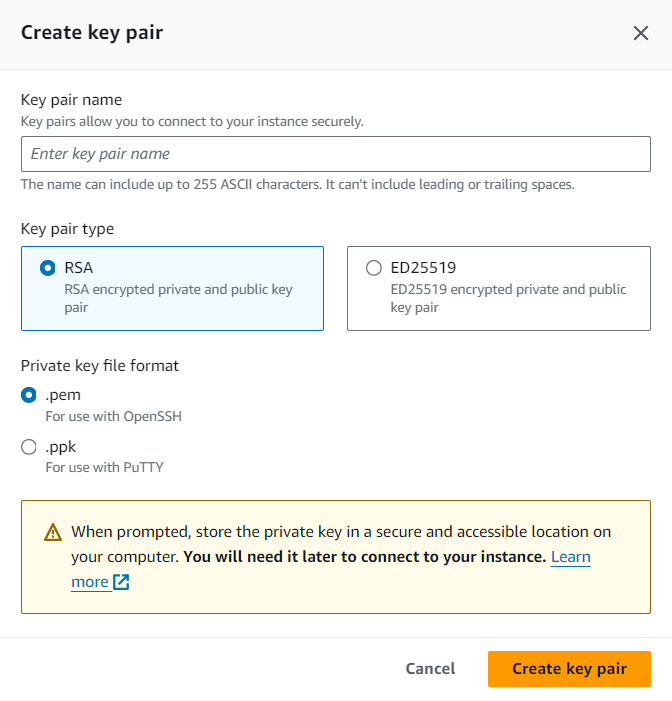

    Select your new key - 
    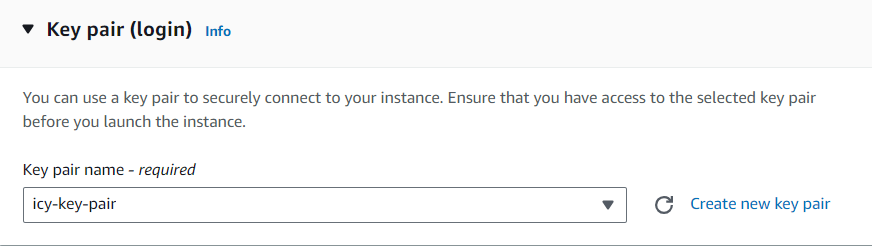

5. Set Network Setting <br />
In network setting we have to define rules and boundaries, like how your instance will react to the outer world or let's say internet. 
We'll allow SSH traffic so that we can connect with our instance. HTTP traffic also because we are hosting a website and we want to access it via our browser.
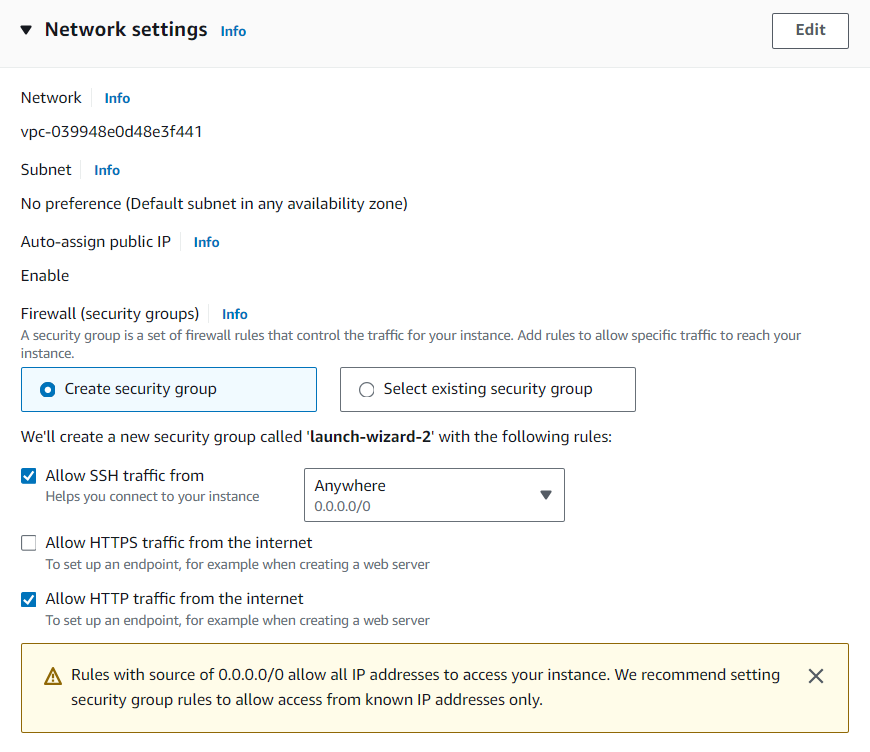

6. Configure storage <br />
We can add more volume to our instance. But it'll depend on scale of our project and it'll also require money. We'll go with default i.e. 8 which is free tier.


Now Once Again Review the details and click on Launch Instance button.

### Now Let's connect with our EC2 instance using SSH ###

1. Open your SSH client (Terminal on your machine) and then go to the location where your .pem file is saved. (Refer above Step 4 in Creating an instance)

2. Run this command, if necessary, to ensure your key is not publicly viewable.
```shell
$ chmod 400 [your-key-name].pem
```

3. In AWS console select your instance and click on the connect button on the top
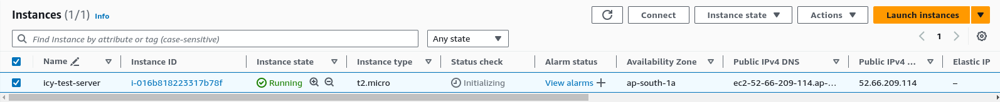

4. We want to connect through SSH Client, so click on it and copy paste the given command in your terminal. 
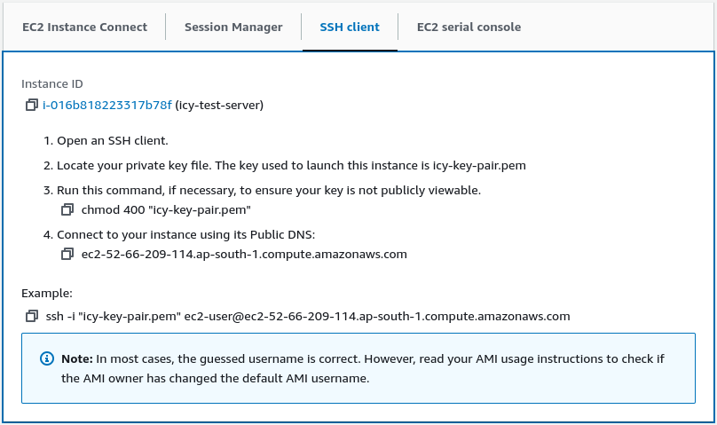

In my case my command is this - 
```shell
$ ssh -i "icy-key-pair.pem" ec2-user@ec2-52-66-209-114.ap-south-1.compute.amazonaws.com
```

To break it down - <br />
**ssh** command is used to provide secure encrypted connection between two host. Then we have one option **-i** which says install, then there is our key-pair name followed by user along with the public DNS of our server.

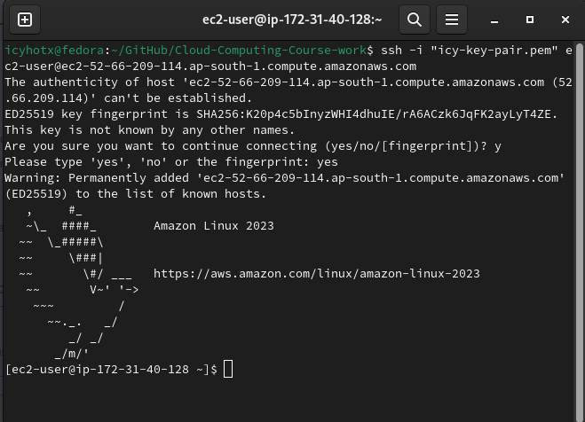


### Installing a Web Server ###

1. Elevate your privileges
```shell
$ sudo su
```

2. Update all packages
```
# yum update -y
```

3. Installing the apache webserver
```
# yum install httpd -y
```

4. Start the webserver 
```
# service httpd start
```

5. Add an index page in your server

```
# cd /var/www/html
html# nano index.html
```

6. Enter your index.html code <br />
For just testing purpose add only one sentence

Type
```
This is icyy, and this is our first EC2 server that we hosted.
```

Press ctrl+x , then press y and Enter.

### Checking Result ###

Now go back to EC2 instance page and select our instance go to deltails section and open the Public IPv4 address in another tab -
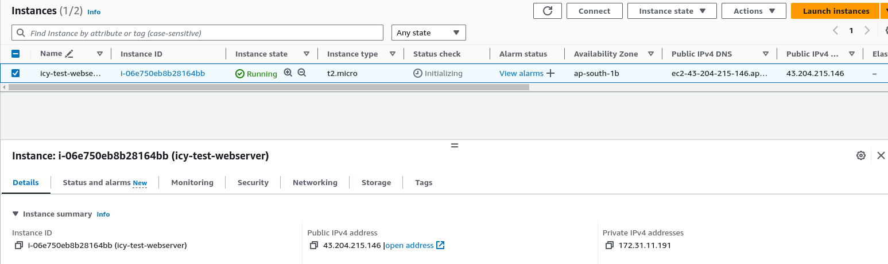
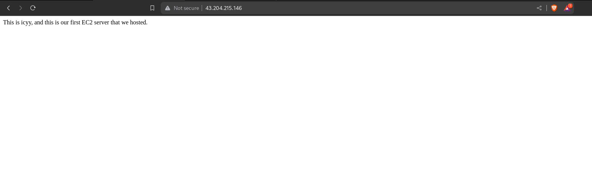

Here we can conclude that we've hosted a static webpage using EC2 in AWS.We can also add more html pages to make it more interactive.