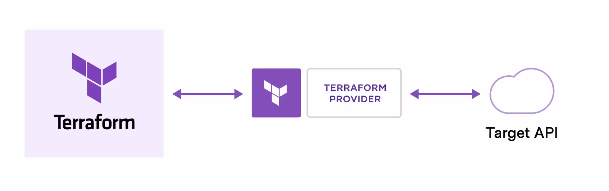
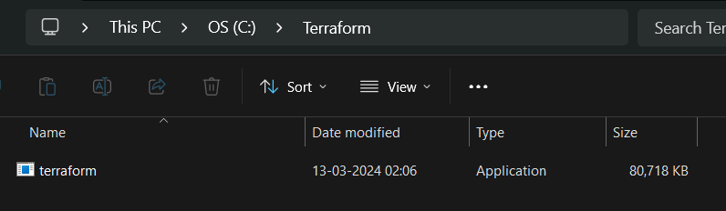
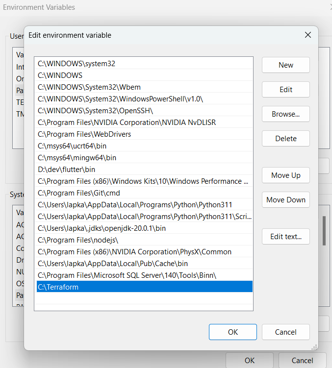
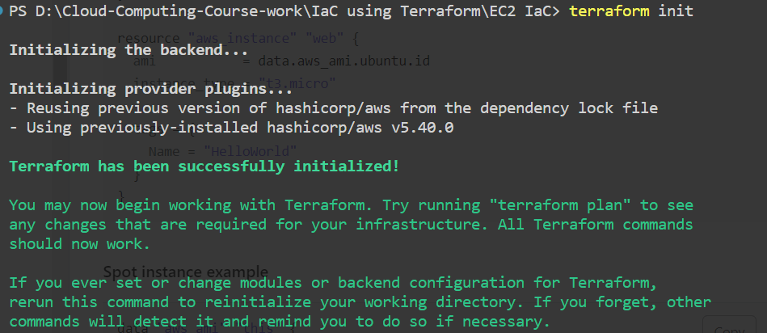
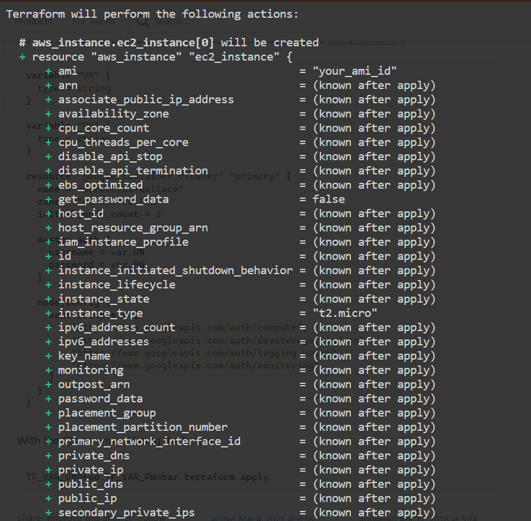
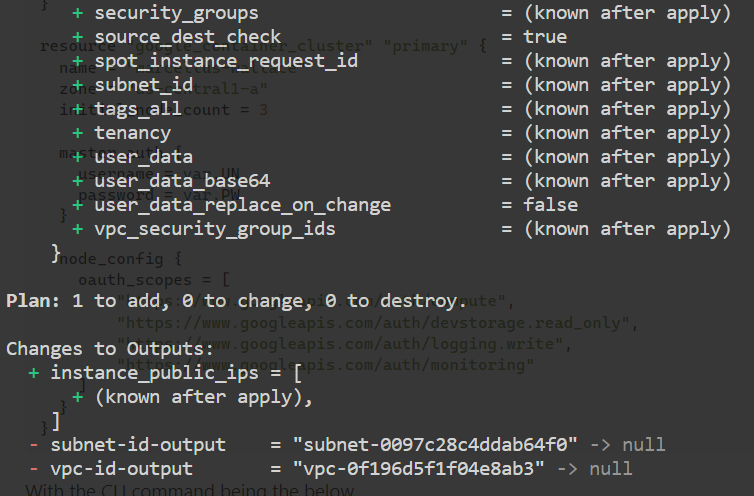
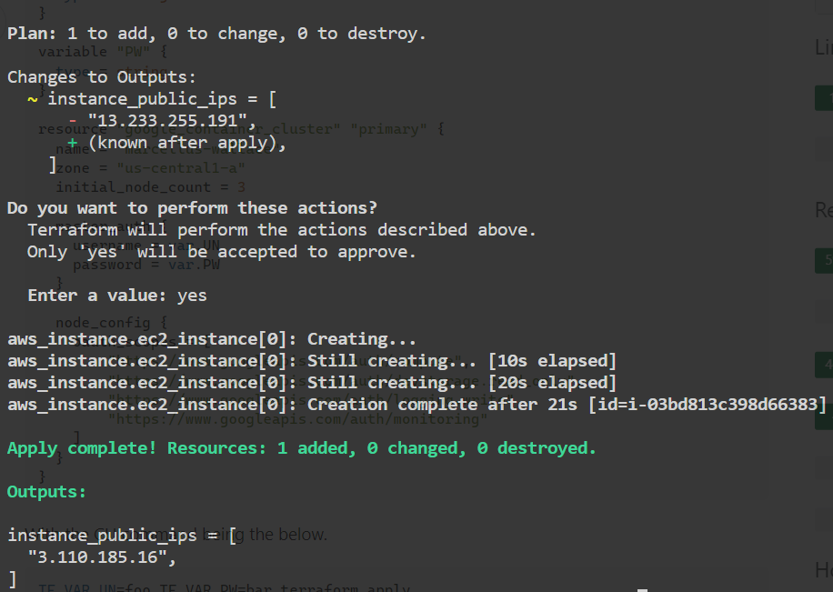
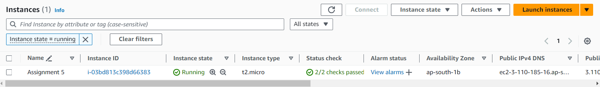

Name -  Priyanshu Lapkale <br />
Class - TY B <br />
Roll No - 322067 <br />
PRN - 22220008 <br />

------
# Assignment 5 #
## Write IaC using terraform to create EC2 machine on AWS or azure or google cloud. (Compulsory to use Input and output variable files) ##

### What is Terraform? ###
HashiCorp Terraform is an infrastructure as code tool that lets you define both cloud and on-prem resources in human-readable configuration files that you can version, reuse, and share. You can then use a consistent workflow to provision and manage all of your infrastructure throughout its lifecycle. Terraform can manage low-level components like compute, storage, and networking resources, as well as high-level components like DNS entries and SaaS features.

<br />

### How does Terraform work? ###
Terraform creates and manages resources on cloud platforms and other services through their application programming interfaces (APIs). Providers enable Terraform to work with virtually any platform or service with an accessible API.

HashiCorp and the Terraform community have already written thousands of providers to manage many different types of resources and services. You can find all publicly available providers on the Terraform Registry, including Amazon Web Services (AWS), Azure, Google Cloud Platform (GCP), Kubernetes, Helm, GitHub, Splunk, DataDog, and many more.

The core Terraform workflow consists of three stages:

* Write: You define resources, which may be across multiple cloud providers and services. For example, you might create a configuration to deploy an application on virtual machines in a Virtual Private Cloud (VPC) network with security groups and a load balancer.
* Plan: Terraform creates an execution plan describing the infrastructure it will create, update, or destroy based on the existing infrastructure and your configuration.
* Apply: On approval, Terraform performs the proposed operations in the correct order, respecting any resource dependencies. For example, if you update the properties of a VPC and change the number of virtual machines in that VPC, Terraform will recreate the VPC before scaling the virtual machines.

<br />

### Terraform Installation ###
1. Download Terraform -
Use the official HashiCorp link to download Terraform depending on your Operating System

2. Setup Environment Variable
<br />

* Click on “Search“ → Search “Edit environment variables”
* Under “Advanced” click on “Environment Variables”
* Click “Path” under System Variables
* Select “Path” → “Add New” → “Terraform_Path” → Paste the path location example — C:\terraform


3. Check if it is installed <br />

```bash
$ terraform -version
```
<br />
<br />

## Creating EC2 using Terraform ##

1. Create a folder and initialize terraform-
```bash
$ terraform init
```

2. Create main.tf file and define the infrastructure of your EC2 instance - 
```terraform
provider "aws" {
  region = var.aws_region
  access_key = var.access_key
  secret_key = var.secret_key
}

resource "aws_instance" "ec2_instance" {
  count         = var.instance_count
  ami           = var.ami_id
  instance_type = var.instance_type
  tags = {
    Name = "Assignment 5"
  }
}

output "instance_public_ips" {
  value = aws_instance.ec2_instance[*].public_ip
}
```
3. Create variables.tf file where we'll define all the required variables -
```terraform
variable "aws_region" {
  description = "The AWS region to deploy the EC2 instance in"
  type        = string
}
variable "access_key" {
  description = "The AWS region to deploy the EC2 instance in"
  type        = string
}
variable "secret_key" {
  description = "The AWS region to deploy the EC2 instance in"
  type        = string
}

variable "instance_type" {
  description = "The type of EC2 instance to launch"
  type        = string
}

variable "ami_id" {
  description = "The ID of the AMI to use for the EC2 instance"
  type        = string
}

variable "instance_count" {
  description = "The number of EC2 instances to launch"
  type        = number
}
```

4. Now create terraform.tfvars file where we'll give all input variable data -
```terraform
aws_region     = "ap-south-1"
instance_type  = "t2.micro"
ami_id         = "ami-001843b876406202a"
access_key     = "******"
secret_key     = "******"
instance_count = 1
```
5. Run this command to know exact plan -
```bash
$ terraform plan
```



6. Run this command to execute your IaC - 
```bash
$ terraform apply
```
This will show you plan again and ask for confirmation to apply changes


Thus we've successfully created EC2 instance in AWS using Terraform -

