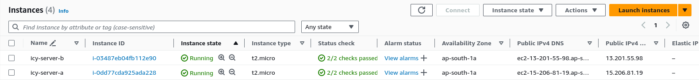
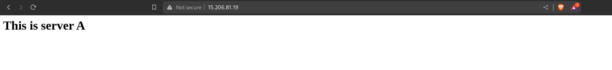
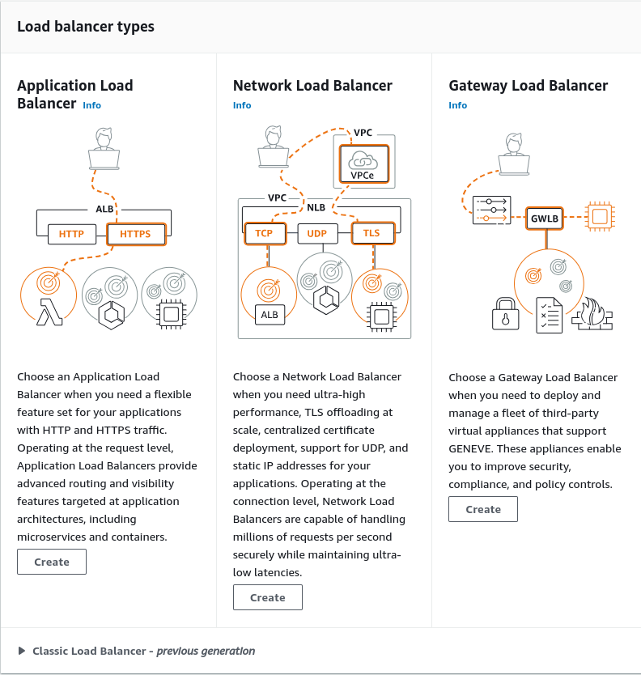
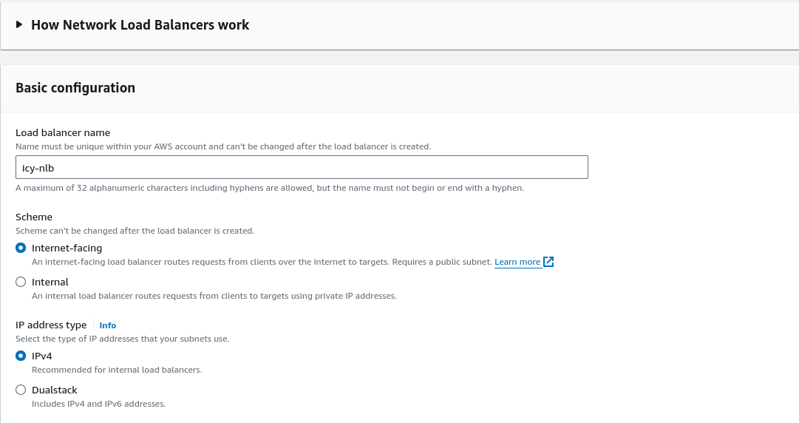
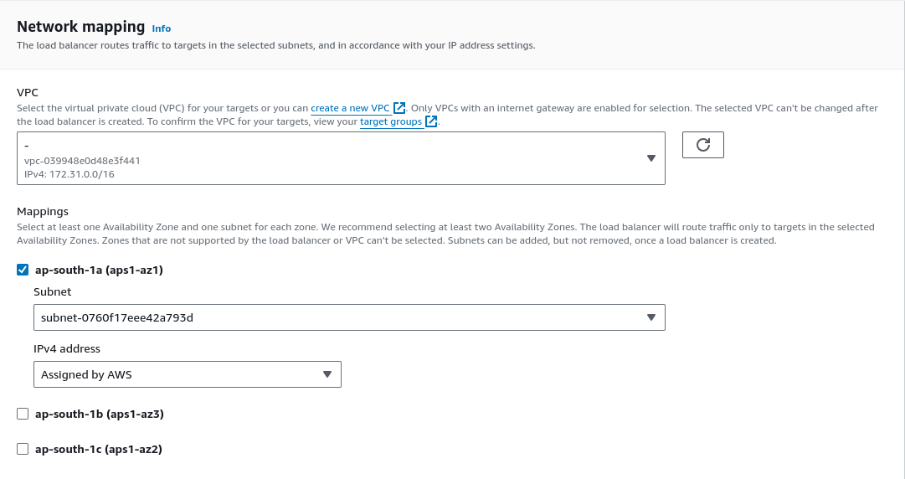
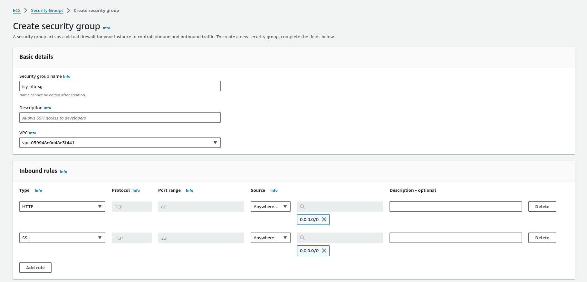
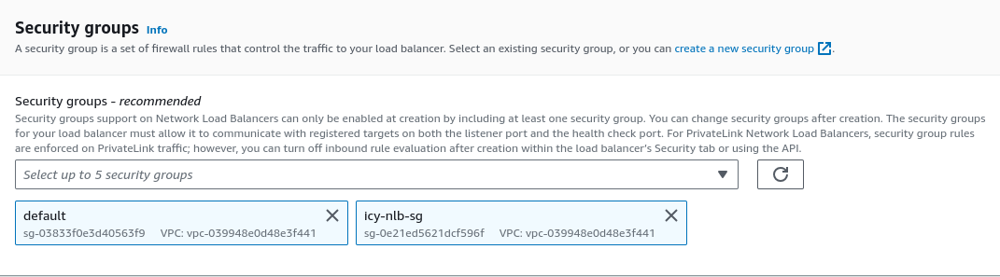

Name -  Priyanshu Lapkale  
Class - TY B  
Roll No - 322067  
PRN - 22220008  

------
## Network Load Balancer on EC2 Instance ##

* NLB serves as the single point of contact for clients. The load balancer distributes incoming traffic across multiple targets, such as Amazon EC2 instances. This increases the availability of your application. You add one or more listeners to your load balancer.

* For example, it is like a toll on a highway that divides all the incoming traffic into multiple lanes, so that all the pressure doesn't come on a single lane. (Here cars i.e. traffic is nothing but users/clients and one lane is one instance and toll is load balancer)

Let's make a NLB that distribute our traffic -

First make few EC2 instances i.e. lanes for which we can make NLB - 
 
  
This is **icy-server-a** :

  
This is **icy-server-b** :

  
Now let's create Network Load Balancer - 
* From the navigation bar on the left select *Load Balancer*.
* Then click on *Create load balancer*
* Then select Network Load Balancer

 
 
1. Basic configuration -  

* Give a suitable name for you network load balancer.
* Select Internet-facing scheme, as we want to routes requests from clients over the internet to target.
* For IP address typer select IPv4

2. Network Mapping -  
For this part if you want to create your VPC you can but i'll be going with default.
Select atleast one availabilty zone for mapping, the NLB will route traffic only to targets in the selected Availabilty Zone.

3. Security Groups - 
Let's create a new SG. Click on create a new security group option.
* Give suitable name for you SG. e.g. icy-nlb-sg (Network Load Balancer Security Group for icy server)
* Set HTTP and SSH for inbound rule with source as Anywhere IPv4. (Anywhere because client will be approching our NLB not instances)

* Now hit create secutity group and go back refresh and add it to security group.

4. Listeners and routing -
This is one of the most important step. Here we want to define for which kind of traffic where we want to forward them.(define the target group)
 
* First create a target group. Click on *Create target group*

* Choose target type - Instances (As we want our ec2 instances as taegets)
* Give a suitable name for target group e.g. icy-ec2-tg
* 