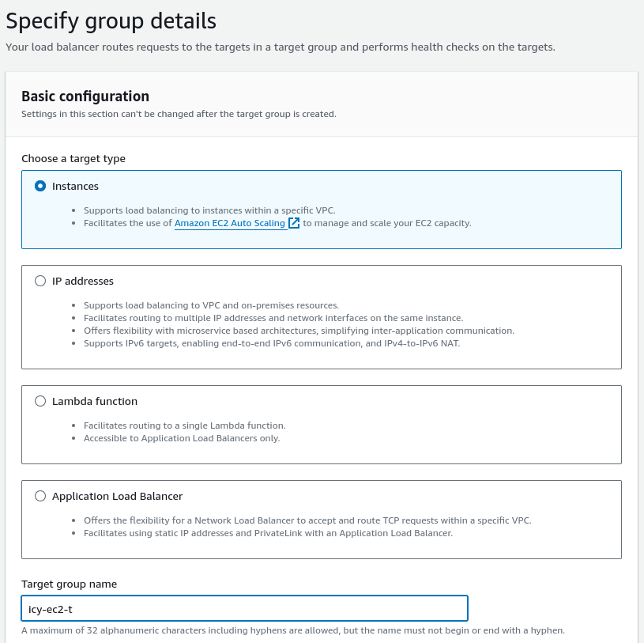
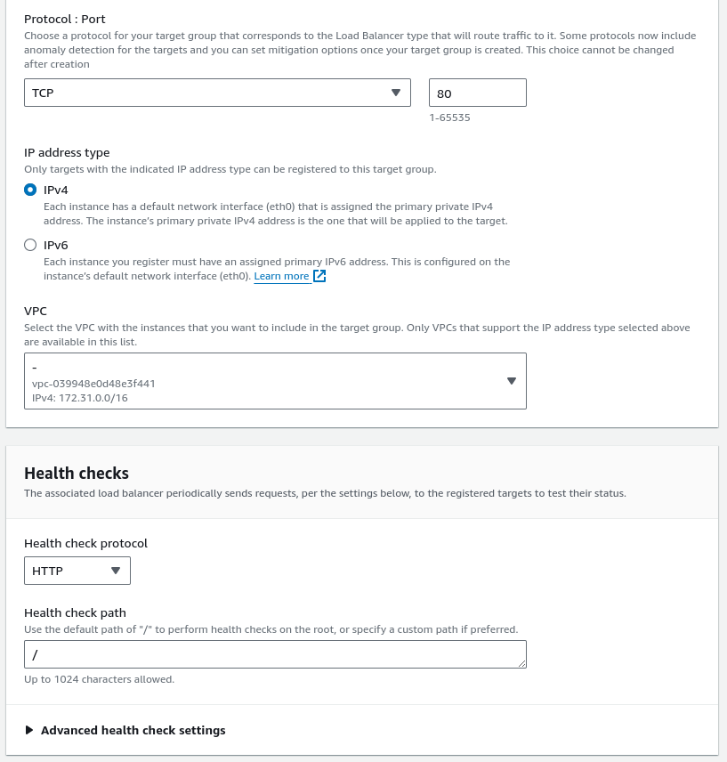
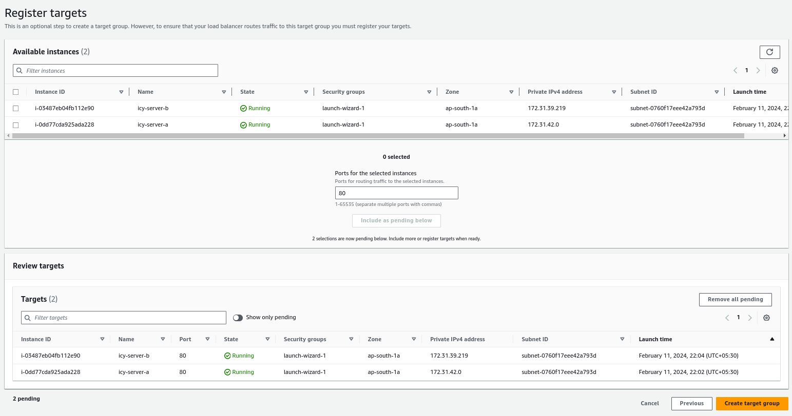
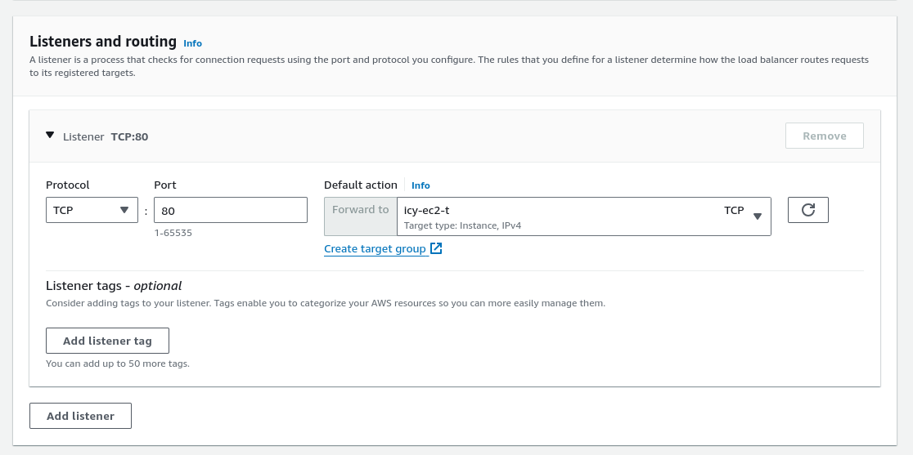
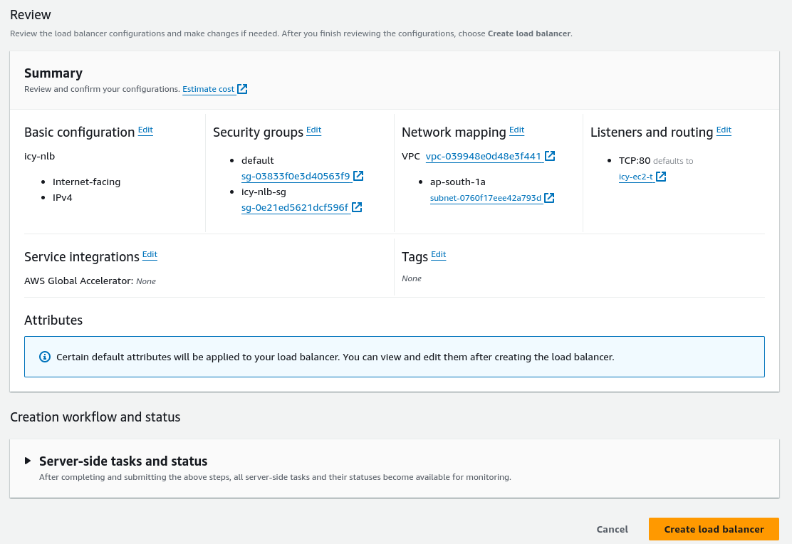
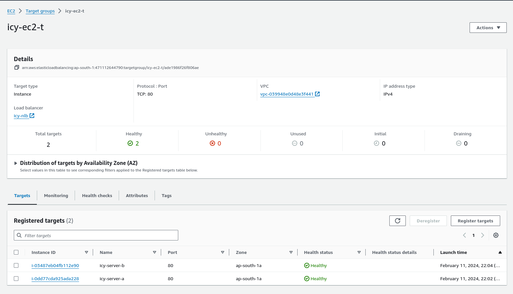
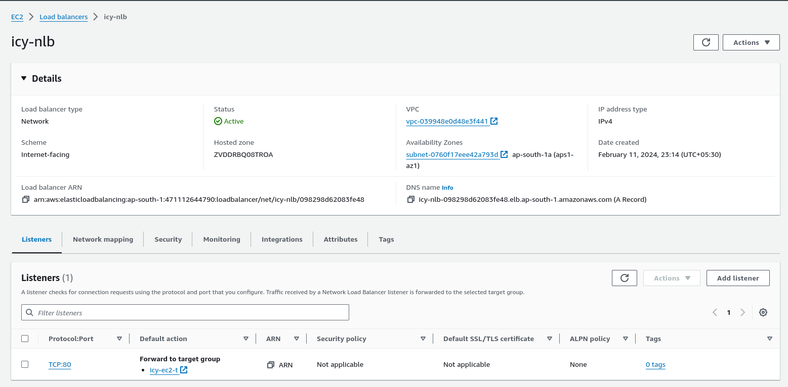
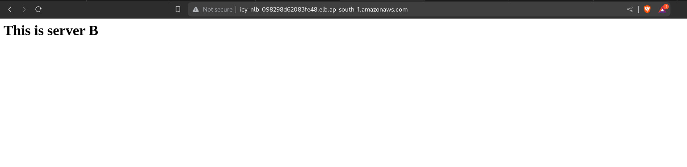
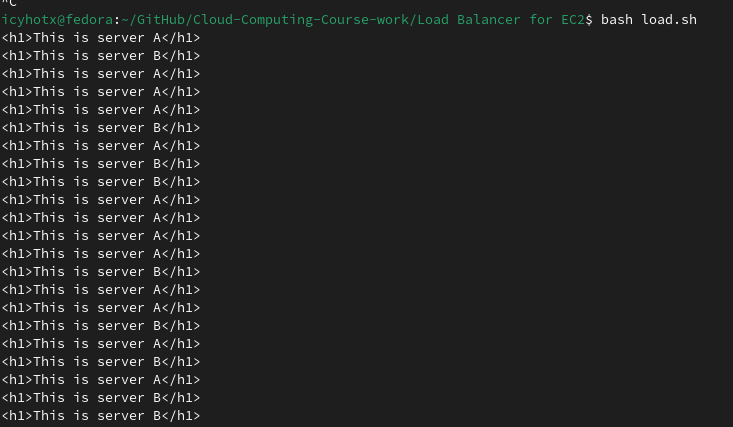
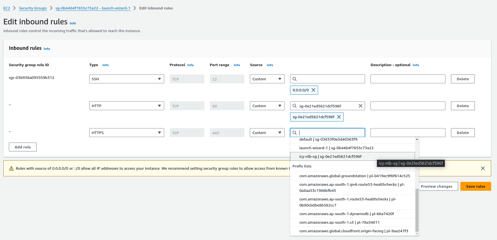

Name -  Priyanshu Lapkale <br />
Class - TY B <br />
Roll No - 322067 <br />
PRN - 22220008 <br />

------
## Network Load Balancer on EC2 Instance ##

* NLB serves as the single point of contact for clients. The load balancer distributes incoming traffic across multiple targets, such as Amazon EC2 instances. This increases the availability of your application. You add one or more listeners to your load balancer.

* For example, it is like a toll on a highway that divides all the incoming traffic into multiple lanes, so that all the pressure doesn't come on a single lane. (Here cars i.e. traffic is nothing but users/clients and one lane is one instance and toll is load balancer)

Let's make a NLB that distribute our traffic -

First make few EC2 instances i.e. lanes for which we can make NLB - 
 
<br /><br />
This is **icy-server-a** :

<br /><br />
This is **icy-server-b** :


<br /><br />
Now let's create Network Load Balancer - 
* From the navigation bar on the left select *Load Balancer*.
* Then click on *Create load balancer*
* Then select Network Load Balancer


<br />
<br />
1. Basic configuration - <br />

* Give a suitable name for you network load balancer.
* Select Internet-facing scheme, as we want to routes requests from clients over the internet to target.
* For IP address typer select IPv4


2. Network Mapping - <br />
For this part if you want to create your VPC you can but i'll be going with default.
Select atleast one availabilty zone for mapping, the NLB will route traffic only to targets in the selected Availabilty Zone.


3. Security Groups - 
Let's create a new SG. Click on create a new security group option.
* Give suitable name for you SG. e.g. icy-nlb-sg (Network Load Balancer Security Group for icy server)
* Set HTTP and SSH for inbound rule with source as Anywhere IPv4. (Anywhere because client will be approching our NLB not instances)

* Now hit create secutity group and go back refresh and add it to security group.


4. Listeners and routing -
This is one of the most important step. Here we want to define for which kind of traffic where we want to forward them.(define the target group)
<br />
* First create a target group. Click on *Create target group*

* Choose target type - Instances (As we want our ec2 instances as taegets)
* Give a suitable name for target group e.g. icy-ec2-tg
* Select protocol as TCP - as incoming traffic will be from TCP
* IP address type - IPv4
* VPC - if you've created other VPC select accordingly but i'll be going with default
* Health Check - Set them as HTTP



You can also explore advance health check options, but i'll leave them as default. Now click on *Next*
<br /> <br />

* Now select which instance you want to target and click on *Include as pending below*
* Then review it once and click on *Create target group*


<br /> <br />
Now go back and select this TG that we created as target group-


At last scroll down at the bottom and click on *Create Load balancer* - 


Finally our NLB is created. But we have to make sure it is working fine, go to the target group tab and check health status of all the instance. If they all are healthy it's a good sign. If they are Unhealthy go to there SG and make sure all rules are logically correct and meet your goal.

<br /><br />
Then also check status of our newly create NLB, make sure it's status is active - 


Copy the DNS name and paste it in new tab. If it is running like this then you are all set - 


<br /> <br />
To check whether is targetting both instances we'll run a script to send continous request on our load balancer. 
```bash
#!/bin/bash
nlwb="icy-nlb-098298d62083fe48.elb.ap-south-1.amazonaws.com"
for((i=0;i<=1000;i++))
do
    curl ${nlwb}
done
```
In this script we'll send 100 request to our NLB.


You can see that with this our load balancer is working perfectly fine.

<br /><br />
We still have one priblem remaining. Our NLB is working fine but whenever if anyone try to access an ec2 instance with it's public IP, they are able to access it. We don't want that because then there won't be any point to create a Load Balancer if they are able to access our instance using public IPs. <br /> <br /> To solve this problem we have to edit security group of our instance. 

* Delete the existing rule for HTTP and HTTPs
* Add new rule for HTTP and HTTPs and set source as custom and set it to our NLB. (With this only our NLB will be able to access our instance and no other. Other can access them through NLB) Client -> NLB -> instanceA/instanceB

<br />
<br />
Here we can conclude that we've successfully created NLB in AWS for our EC2 instance.