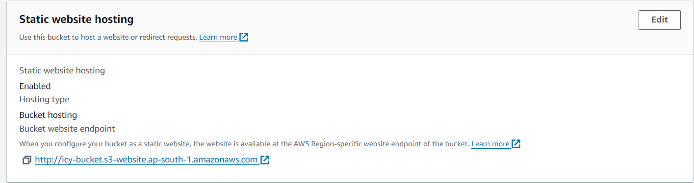
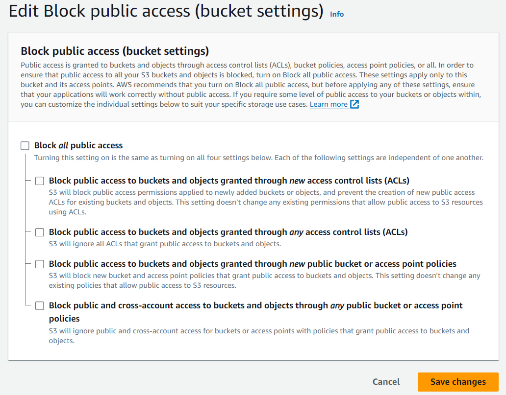
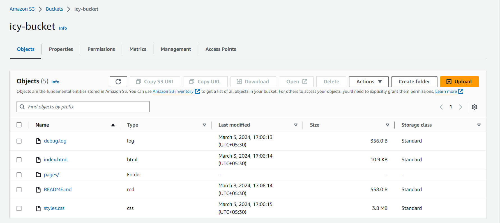

Name -  Priyanshu Lapkale <br />
Class - TY B <br />
Roll No - 322067 <br />
PRN - 22220008 <br />

------

## Assignment 4 ##
## Hosting website on S3 bucket ##
* Amazon S3 or Amazon Simple Storage Service is a service offered by Amazon Web Services that provides object storage through a web service interface. Amazon S3 uses the same scalable storage infrastructure that Amazon.com uses to run its e-commerce network

1. Object-based storage : Amazon S3 stores data as objects within buckets. 
An object consists of data, metadata (attributes or properties associated 
with the object), and a unique identifier. Each object is stored as a file 
and can range in size from a few bytes to terabytes.
2. Scalability and durability : Amazon S3 is designed to provide high 
scalability and durability for storing data. It can seamlessly scale to 
accommodate large volumes of data and handle a virtually unlimited 
number of objects. S3 stores data redundantly across multiple facilities 
and devices within a region to ensure high durability and availability.
3. Data availability and accessibility : S3 provides high availability and low 
latency for accessing stored data. Objects stored in S3 are accessible over 
the internet via unique URLs, making it easy to retrieve data from 
anywhere with an internet connection. S3 supports a variety of access 
methods, including RESTful APIs, SDKs for popular programming 
languages, and web-based management consoles.
4. Security and compliance : Amazon S3 offers robust security features to 
protect stored data and control access to it. Users can configure access 
policies and permissions to restrict who can access, upload, download, 
or modify objects within buckets. S3 also supports server-side encryption 
to encrypt data at rest, as well as SSL/TLS encryption for secure data 
transfer over the internet. Additionally, S3 integrates with AWS Identity 
and Access Management (IAM) for fine-grained access control.
5. Data management and lifecycle policies : S3 provides features for 
managing and organizing data stored in buckets. Users can create 
lifecycle policies to automatically transition objects between different 
storage classes (e.g., from Standard to Infrequent Access or Glacier) 
based on predefined rules such as object age or access frequency. This 
helps optimize storage costs by moving less frequently accessed data to 
lower-cost storage tiers.
6. Versioning and data protection : Amazon S3 supports versioning, 
allowing users to keep multiple versions of objects in a bucket. This helps 
protect against accidental deletion or modification of data by enabling 
users to restore previous versions of objects if needed. S3 also provides 
features for logging and monitoring bucket activity, enabling users to 
track access, changes, and usage of stored data.
7. Integration with AWS ecosystem : Amazon S3 integrates seamlessly with 
other AWS services and solutions, making it a foundational component 
of many cloud-based applications and workflows. It can be used in 
conjunction with services such as AWS Lambda, Amazon CloudFront, 
Amazon Athena, Amazon EMR, and more to build scalable, cost-effective, 
and reliable solutions for data storage, processing, analytics, and content 
delivery.

### Implementation ###

First seacrh for S3 on AWS Services tab and follow the given steps - 

1. Click on Create Bucket


2. General Configuration
* Select AWS region where you wand to create a bucket.
* Set a unique bucket name that makes sense.
* You can also copy any existing bucket setting to create new one.

<br />

3. Object Ownership <br />
Here we can enable or disable ACLs. ACLs (Access control lists) is a mechanism you can use to define who has access to your buckets and objects, as well as what level of access they have. <br />
We are keeping it disable. (That's for other tutorial)


4. Block Public Access settings for this bucket <br />
* Select block all public access


5. Bucket Versioning <br />
You can enable bucket versioning as aws will keep track of all the records/logs for the S3 bucket  just like a VCS (Version Control System).


6. Default encryption <br />
* Select Encryption type -  which encryption you want to apply whenever a new object is added
* Set Bucket Key to Enable


Now Click on Create Bucket.

### S3 Configuarations -  ### 

1. Click on bucket and go to Properties tab. At the bottom of it you have to enable static website hosting.


2. Go to Permission tabs and search for Block public access (bucket settings) and click on Edit. There clear all the checkboxes.

If you want to access your static website from outside you've to allow public traffic.

3. After you edit S3 Block Public Access settings, you can add a bucket policy to grant public read access to your bucket. When you grant public read access, anyone on the internet can access your bucket.
<br /><br />In the same tab go to Bucket Policy and paste the code - 
```json
{
    "Version": "2012-10-17",
    "Id": "Policy1709464970072",
    "Statement": [
        {
            "Sid": "Stmt1709464881958",
            "Effect": "Allow",
            "Principal": "*",
            "Action": "s3:GetObject",
            "Resource": "arn:aws:s3:::{Bucket-name}/*"
        }
    ]
}
```
Put your own bucket name in it. You can also take help of amazon official Policy Generator to generate policy.
https://awspolicygen.s3.amazonaws.com/policygen.html
<br /><br />

4. Go to objects tab and upload an index.html file. You can use the one that i'm using in this. Just download and upload these files in the bucket. (Make sure index.html is in the root directory)


5. Now go to Properties tab and under the static website hosting option copy the URL and open it in new tab. 


<br />
<br />
<br />
Hence, we've hosted a static website using AWS S3 Bucket.