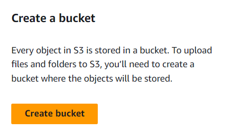
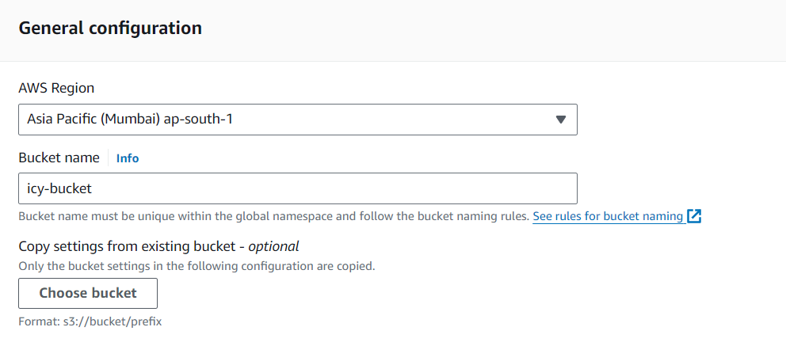
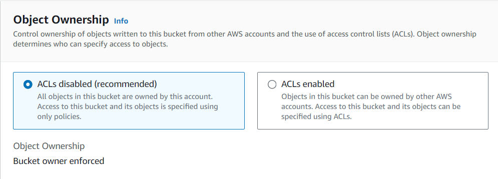
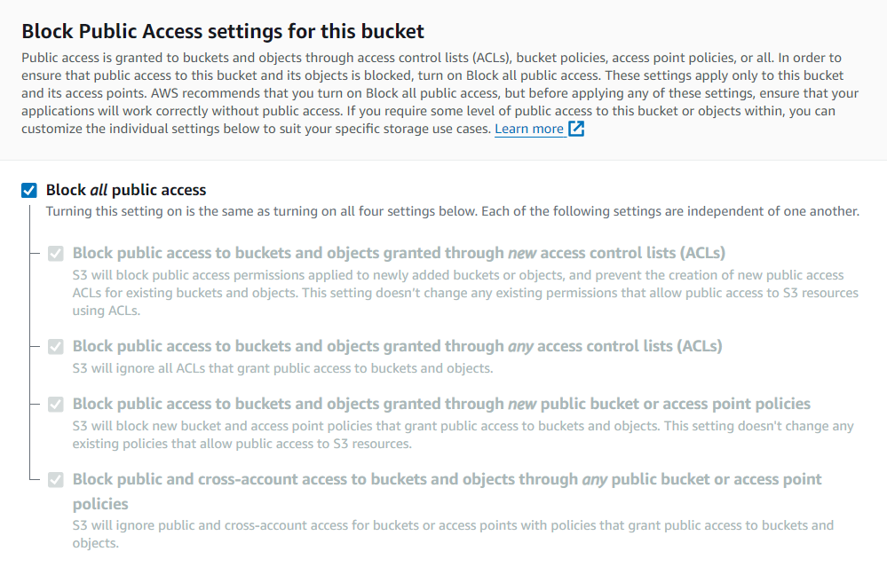
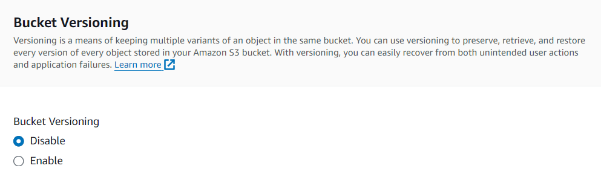
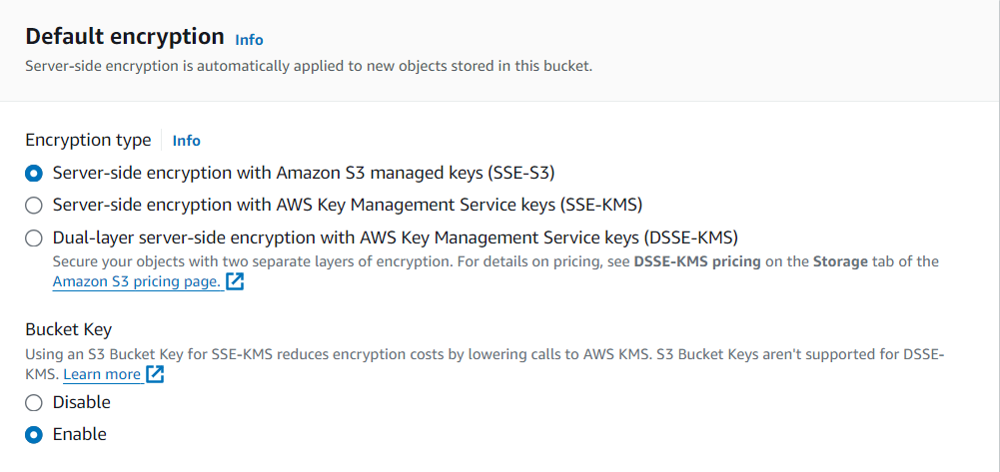

Name -  Priyanshu Lapkale  
Class - TY B  
Roll No - 322067  
PRN - 22220008  

------
## Hosting website on S3 bucket ##
* Amazon S3 or Amazon Simple Storage Service is a service offered by Amazon Web Services that provides object storage through a web service interface. Amazon S3 uses the same scalable storage infrastructure that Amazon.com uses to run its e-commerce network

First seacrh for S3 on AWS Services tab and follow the given steps - 

1. Click on Create Bucket

2. General Configuration
* Select AWS region where you wand to create a bucket.
* Set a unique bucket name that makes sense.
* You can also copy any existing bucket setting to create new one.

 

3. Object Ownership  
Here we can enable or disable ACLs. ACLs (Access control lists) is a mechanism you can use to define who has access to your buckets and objects, as well as what level of access they have.  
We are keeping it disable. (That's for other tutorial)

4. Block Public Access settings for this bucket  
* Select block all public access

5. Bucket Versioning  
You can enable bucket versioning as aws will keep track of all the records/logs for the S3 bucket  just like a VCS (Version Control System).

6. Default encryption  
* Select Encryption type -  which encryption you want to apply whenever a new object is added
* Set Bucket Key to Enable

Now Click on Create Bucket.