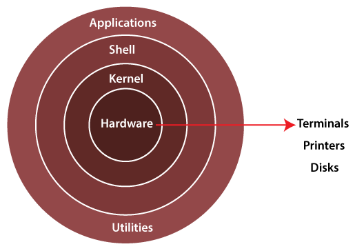

Name -  Minakshi Kotnake <br />
Class - TY D <br />
Roll No - 324032 <br />
PRN - 22110838 <br />

------
# Assignment 2 #
## Shell Scripting Programs 

### WHAT IS SHELL? ###
The shell is a command-line interface that allows users to interact with the operating system by Executing text-based commands. In a Linux architecture, it acts as an interface between the user and the kernel, interpreting user commands and directing them to the kernel for execution. The shell Reads commands from standard input (e.g., keyboard) or from a script file and passes them to the kernel for execution. The diagram of the Linux kernel architecture is a graphical representation that shows the components of the Linux operating system and how they interact with each other. The diagram typically includes the kernel, system libraries, shell, and other system components.

### Linux Shell Architechture ###



### Types of shell: ###
There are several different types of shells in Linux, including:
1. Bourne shell (sh): This is the original UNIX shell and is still widely used in Unix-based systems.
2. C shell (csh): This shell is based on the C programming language and is known for its interactive features, such as command history and command line editing.
3. Korn shell (ksh): This shell is an improvement on the Bourne shell, adding features such as command line editing and arrays.
4. Bourne Again Shell (bash): It is also known as Bash Shell, This shell combines features of the Korn shell and C shell. This shell was designed as an extended version of the Bourne shell.Bourne Again Shell can automatically load previously used commands and can be edited with the help of the arrow keys of the keyboard.
5. Z shell (zsh): This shell is similar to bash, but has additional features such as improved tab completion and the ability to handle multiple terminal sessions.
6.Fish shell (fish): This shell is designed to be user-friendly and easy to use, with features such as syntax highlighting and auto-suggestions.
7. Tcsh: This is an enhanced version of the C shell, with additional features such as command line completion and spelling correction.
<br /><br />
### Problem statements for shell scripting:
a. Write a shell script to check user is root user or not

```shell
#!/bin/bash
if [ "$(id -u)" -eq 0 ]; then
    echo "You are the root user."
else
    echo "You are not the root user."
fi
```
<br />
<br />

b. Write a shell script to install any particular software (ex: java or python)
```shell
#!/bin/bash
if ! command -v pip &> /dev/null; then
    echo "Error: pip is not installed. Please install pip and try again."
    exit 1
fi
pip install selenium
```
<br /><br />

c. Write a shell script to check disk usage of the system and if disk
usage is more than 90% it should send an email to system admin. This
script should run everyday at 8:00 AM.
```shell
#!/bin/bash

THRESHOLD=90

disk_usage=$(df -h / | sed '1d' | awk '{ print $5 }' | sed 's/%//')

if [ "$disk_usage" -gt "$THRESHOLD" ]; then
    subject="Disk usage alert on $(hostname)"

    body="Disk usage is above $THRESHOLD%.\n\n$(df -h)"

    echo -e "$body" | mail -s "$subject" lapkale0110@gmail.com
fi
```

Open terminal and enter:
```bash
$ crontab -e
```
Add this line in your crontab file:
```shell
0 8 * * * /path/to/your/script.sh
```
Replace /path/to/your/script.sh with the actual path to your script file.

<br /><br />

d. Write a shell script to take mysql database server backup. This script should run weekly on every sunday at 11:00 PM.
```shell
#!/bin/bash

MYSQL_USER="username"
MYSQL_PASSWORD="password"

BACKUP_DIR="/path/to/backup/directory"

DATE=$(date +%Y-%m-%d_%H-%M-%S)

mkdir -p $BACKUP_DIR

BACKUP_FILE="$BACKUP_DIR/all-databases-$DATE.sql"

mysqldump -u $MYSQL_USER -p$MYSQL_PASSWORD --all-databases > $BACKUP_FILE

if [ $? -eq 0 ]; then
    echo "MySQL backup completed successfully."
else
    echo "MySQL backup failed."
fi
```

Open terminal and enter:
```bash
$ crontab -e
```
Add this line in your crontab file:
```shell
0 23 * * * /path/to/your/script.sh
```
Replace /path/to/your/script.sh with the actual path to your script file.